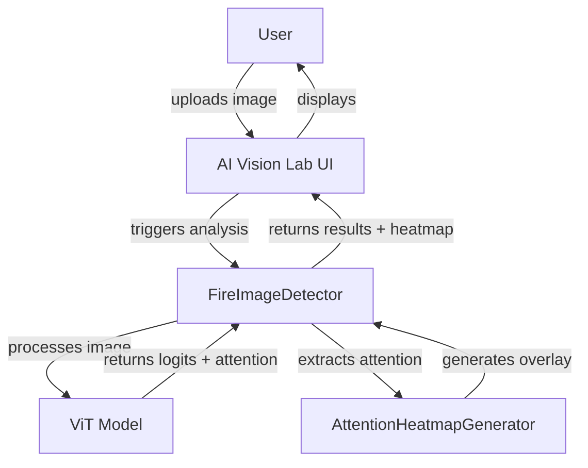
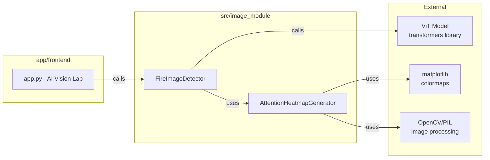
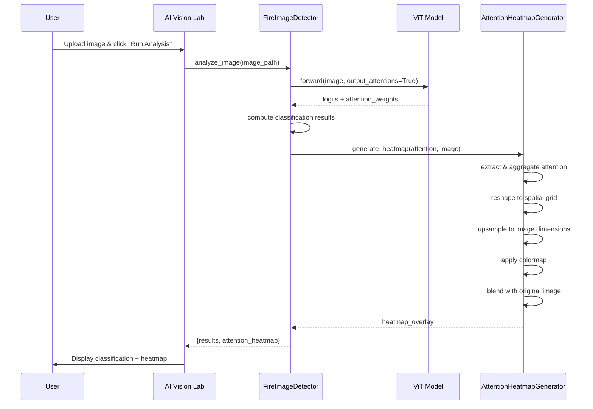

# Design Document: Attention Heatmap Visualization

## Overview

This design document specifies the architecture and implementation approach for adding attention heatmap visualization to the PyroWatch wildfire detection application. The feature extracts attention weights from the Vision Transformer (ViT) model and generates visual heatmap overlays that show which image regions the model focuses on during fire detection decisions.

### Key Design Goals

1. **Explainability**: Provide visual insight into model decision-making through attention visualization
2. **Integration**: Seamlessly integrate with existing FireImageDetector workflow without breaking changes
3. **Performance**: Generate heatmaps efficiently (<2 seconds) using GPU acceleration when available
4. **Robustness**: Handle errors gracefully without disrupting core fire detection functionality
5. **Usability**: Display intuitive visualizations in the AI Vision Lab interface

### Technical Approach

The implementation follows the **Attention Rollout** methodology ([content rephrased for compliance with licensing restrictions](https://medium.com/@UlamacaLEE/a-short-note-on-visualizing-attention-of-vision-transformer-vit-a6b67377a914)), which aggregates attention weights across layers and heads to estimate the flow of attention through the ViT network. We extract attention from the final transformer layer, aggregate across attention heads, and visualize the CLS token's attention to image patches as a spatial heatmap.

## Architecture

### System Context



### Component Architecture



### Data Flow



## Components and Interfaces

### 1. AttentionHeatmapGenerator

**Purpose**: Extracts attention weights from ViT model outputs and generates visual heatmap overlays.

**Location**: `src/image_module/attention_heatmap.py` (new file)

**Class Definition**:

```python
class AttentionHeatmapGenerator:
    """Generates attention heatmap visualizations from ViT model attention weights."""
    
    def __init__(self, colormap: str = 'viridis', opacity: float = 0.5):
        """
        Initialize the heatmap generator.
        
        Args:
            colormap: Perceptually-uniform colormap name ('viridis', 'plasma', 'inferno')
            opacity: Blending opacity for overlay (0.4-0.6 recommended)
        """
        
    def generate_heatmap(
        self, 
        attention_weights: torch.Tensor, 
        original_image: np.ndarray,
        patch_size: int = 16
    ) -> Optional[np.ndarray]:
        """
        Generate attention heatmap overlay from ViT attention weights.
        
        Args:
            attention_weights: Attention tensor from ViT final layer
                              Shape: (num_heads, num_patches+1, num_patches+1)
            original_image: Original input image as numpy array (H, W, 3)
            patch_size: Size of ViT patches (default 16 for ViT-base)
            
        Returns:
            Heatmap overlay as numpy array (H, W, 3) or None if generation fails
        """
```

**Key Methods**:

- `_aggregate_attention_heads()`: Aggregates attention across all heads using mean
- `_extract_cls_attention()`: Extracts CLS token attention to image patches
- `_reshape_to_spatial()`: Reshapes 1D attention to 2D spatial grid
- `_upsample_to_image_size()`: Upsamples attention map to match image dimensions
- `_normalize_attention()`: Normalizes attention values to [0, 1] range
- `_apply_colormap()`: Applies perceptually-uniform colormap to attention values
- `_blend_with_image()`: Blends colored heatmap with original image

### 2. FireImageDetector (Modified)

**Purpose**: Orchestrates image analysis, classification, and attention extraction.

**Location**: `src/image_module/vit_model.py` (existing file, modified)

**Modified Interface**:

```python
class FireImageDetector:
    def __init__(self, enable_attention: bool = True):
        """
        Initialize the fire detection model.
        
        Args:
            enable_attention: Whether to extract attention weights (default True)
        """
        self.enable_attention = enable_attention
        self.heatmap_generator = AttentionHeatmapGenerator() if enable_attention else None
        
    def analyze_image(self, image_path: str) -> Optional[Dict[str, Any]]:
        """
        Analyze image for fire detection with optional attention visualization.
        
        Args:
            image_path: Path to image file
            
        Returns:
            Dictionary containing:
                - 'results': List of classification results (backward compatible)
                - 'attention_heatmap': Numpy array of heatmap overlay (if enabled)
                - 'error': Error message if attention extraction failed (optional)
        """
```

**Key Changes**:

- Add `output_attentions=True` parameter when calling model forward pass
- Add `attn_implementation="eager"` to model loading ([based on HuggingFace documentation](https://discuss.huggingface.co/t/attentions-not-returned-from-transformers-vit-model-when-using-output-attentions-true/91203))
- Extract attention weights from model outputs
- Call `AttentionHeatmapGenerator` to create visualization
- Return both classification results and heatmap in single response
- Maintain backward compatibility by keeping `results` as primary key

### 3. AI Vision Lab UI (Modified)

**Purpose**: Display attention heatmap alongside classification results.

**Location**: `app/frontend/app.py` (existing file, modified)

**UI Layout Changes**:

```python
# After classification results display
if 'attention_heatmap' in results and results['attention_heatmap'] is not None:
    st.markdown("""
    <div class="section-header">
        <h3>🔍 Attention Heatmap</h3>
        <div class="section-divider"></div>
    </div>
    <p style="color:#9CA3AF;font-size:0.85rem;">
        Visualization showing which image regions the AI model focused on during analysis.
        <span style="color:#F59E0B;">Warm colors</span> indicate high attention, 
        <span style="color:#3B82F6;">cool colors</span> indicate low attention.
    </p>
    """, unsafe_allow_html=True)
    
    col_orig, col_heat = st.columns(2)
    with col_orig:
        st.markdown("**Original Image**")
        st.image(image, use_container_width=True)
    with col_heat:
        st.markdown("**Attention Overlay**")
        st.image(results['attention_heatmap'], use_container_width=True)
```

## Data Models

### AttentionData

```python
@dataclass
class AttentionData:
    """Container for attention-related data."""
    raw_attention: torch.Tensor  # Shape: (num_heads, seq_len, seq_len)
    aggregated_attention: np.ndarray  # Shape: (seq_len, seq_len)
    spatial_attention: np.ndarray  # Shape: (grid_h, grid_w)
    heatmap_overlay: np.ndarray  # Shape: (img_h, img_w, 3)
```

### AnalysisResult

```python
@dataclass
class AnalysisResult:
    """Container for complete analysis results."""
    results: List[Dict[str, Any]]  # Classification results (backward compatible)
    attention_heatmap: Optional[np.ndarray] = None  # Heatmap overlay
    attention_data: Optional[AttentionData] = None  # Detailed attention data
    error: Optional[str] = None  # Error message if attention failed
```

### Configuration

```python
@dataclass
class HeatmapConfig:
    """Configuration for heatmap generation."""
    colormap: str = 'viridis'  # 'viridis', 'plasma', or 'inferno'
    opacity: float = 0.5  # Blending opacity (0.4-0.6)
    interpolation: str = 'bilinear'  # Upsampling method
    normalize_method: str = 'minmax'  # 'minmax' or 'softmax'
    cache_colormaps: bool = True  # Cache colormap objects
```

## Correctness Properties

*A property is a characteristic or behavior that should hold true across all valid executions of a system—essentially, a formal statement about what the system should do. Properties serve as the bridge between human-readable specifications and machine-verifiable correctness guarantees.*

### Property 1: Attention Extraction Pipeline Produces Valid Spatial Map

*For any* valid input image processed by the ViT model, extracting attention weights, aggregating across heads, and reshaping to spatial dimensions SHALL produce a 2D attention map with dimensions matching the patch grid (image_size / patch_size)².

**Validates: Requirements 1.1, 1.2, 1.3**

### Property 2: Heatmap Generation Produces Valid RGB Overlay

*For any* valid attention weights and original image, generating a heatmap SHALL produce an RGB image with the same dimensions as the original image, with all pixel values in the range [0, 255], and attention values normalized to [0, 1] before colormap application.

**Validates: Requirements 2.1, 2.2, 2.4**

### Property 3: Heatmap Blending Preserves Image Dimensions

*For any* heatmap and original image, blending at opacity in range [0.4, 0.6] SHALL produce an output image with identical dimensions to the input image and all pixel values in the valid range [0, 255].

**Validates: Requirements 2.3, 2.5**

### Property 4: Classification Results Are Preserved During Attention Extraction

*For any* input image, running classification with attention extraction enabled SHALL produce identical classification results (labels and confidence scores) as running classification without attention extraction.

**Validates: Requirements 1.5**

### Property 5: Analysis Returns Both Classification and Attention Data

*For any* valid input image when attention is enabled, the analyze_image method SHALL return a dictionary containing both 'results' (classification data) and 'attention_heatmap' (visualization data) in a single response.

**Validates: Requirements 4.1, 4.2**

### Property 6: Single Forward Pass Efficiency

*For any* image analysis with attention enabled, the ViT model forward pass SHALL be called exactly once, with attention weights extracted from that single pass without requiring additional inference.

**Validates: Requirements 4.3, 6.2**

### Property 7: Backward Compatibility Maintained

*For any* existing code that accesses classification results using the pattern `results[0]['label']` or `results[0]['confidence']`, the modified analyze_image method SHALL continue to support this access pattern without modification.

**Validates: Requirements 4.4**

### Property 8: Graceful Degradation When Attention Disabled

*For any* input image when attention extraction is disabled, the analyze_image method SHALL return classification results normally without attention data and without errors.

**Validates: Requirements 4.5**

### Property 9: Unusual Image Dimensions Handled Correctly

*For any* input image with unusual dimensions (aspect ratios >3:1 or <1:3, non-square dimensions), the heatmap generator SHALL resize the attention map to match the image dimensions while maintaining valid pixel values.

**Validates: Requirements 5.2**

### Property 10: GPU Acceleration Used When Available

*For any* attention weight processing, if a CUDA-capable GPU is available and PyTorch detects it, attention tensors SHALL be processed on the GPU device; otherwise, processing SHALL fall back to CPU without errors.

**Validates: Requirements 6.4**

### Property 11: Colormap Caching Across Multiple Images

*For any* sequence of multiple image analyses using the same colormap configuration, the colormap object SHALL be created once and reused for all subsequent heatmap generations within the same session.

**Validates: Requirements 6.3**

## Error Handling

### Error Categories

1. **Model Compatibility Errors**
   - Model doesn't support `output_attentions` parameter
   - Model architecture incompatible with attention extraction
   - **Handling**: Log error, return classification results without attention, display user-friendly message

2. **Attention Extraction Errors**
   - Attention weights not returned by model
   - Attention tensor has unexpected shape
   - **Handling**: Log error with details, return classification results, set `error` field in response

3. **Image Processing Errors**
   - Image dimensions incompatible with patch size
   - Memory allocation failure during upsampling
   - **Handling**: Attempt lower resolution fallback, log error, return None for heatmap

4. **Visualization Errors**
   - Colormap application failure
   - Blending operation failure
   - **Handling**: Log error, return None for heatmap, classification continues normally

### Error Handling Strategy

```python
def generate_heatmap(self, attention_weights, original_image, patch_size=16):
    try:
        # Attention extraction
        aggregated = self._aggregate_attention_heads(attention_weights)
        cls_attention = self._extract_cls_attention(aggregated)
        spatial = self._reshape_to_spatial(cls_attention, patch_size)
        
        # Heatmap generation
        upsampled = self._upsample_to_image_size(spatial, original_image.shape[:2])
        normalized = self._normalize_attention(upsampled)
        colored = self._apply_colormap(normalized)
        overlay = self._blend_with_image(colored, original_image)
        
        return overlay
        
    except ValueError as e:
        logger.error(f"Invalid attention dimensions: {e}")
        return None
    except RuntimeError as e:
        logger.error(f"Memory error during heatmap generation: {e}")
        # Attempt lower resolution fallback
        try:
            return self._generate_low_res_heatmap(attention_weights, original_image)
        except Exception:
            return None
    except Exception as e:
        logger.error(f"Unexpected error in heatmap generation: {e}")
        return None
```

### Logging Strategy

- **INFO**: Successful heatmap generation with timing information
- **WARNING**: Fallback to lower resolution, attention disabled
- **ERROR**: Attention extraction failure, incompatible model, processing errors
- **DEBUG**: Detailed tensor shapes, intermediate values for troubleshooting

## Testing Strategy

### Unit Testing

**Focus Areas**:
- Attention aggregation logic with specific head configurations
- Spatial reshaping with known patch sizes
- Normalization edge cases (all zeros, all same value, negative values)
- Colormap application with boundary values
- Blending with various opacity values
- Error handling for specific failure modes

**Example Unit Tests**:
```python
def test_aggregate_attention_single_head():
    """Test aggregation with single attention head."""
    attention = torch.randn(1, 197, 197)
    result = generator._aggregate_attention_heads(attention)
    assert result.shape == (197, 197)

def test_normalize_attention_all_zeros():
    """Test normalization handles all-zero input."""
    attention = np.zeros((14, 14))
    result = generator._normalize_attention(attention)
    assert np.all(result == 0)

def test_error_when_model_lacks_attention():
    """Test graceful error when model doesn't return attention."""
    detector = FireImageDetector()
    # Mock model to return None for attentions
    result = detector.analyze_image("test.jpg")
    assert 'results' in result
    assert result['attention_heatmap'] is None
```

### Property-Based Testing

**Testing Library**: Use `hypothesis` for Python property-based testing

**Configuration**: Minimum 100 iterations per property test

**Property Test Examples**:

```python
from hypothesis import given, strategies as st
import hypothesis.extra.numpy as npst

@given(
    attention=npst.arrays(
        dtype=np.float32,
        shape=st.tuples(
            st.integers(min_value=1, max_value=12),  # num_heads
            st.just(197),  # seq_len (196 patches + 1 CLS)
            st.just(197)
        )
    ),
    patch_size=st.integers(min_value=8, max_value=32)
)
def test_property_attention_extraction_produces_valid_spatial_map(attention, patch_size):
    """
    Property 1: Attention extraction pipeline produces valid spatial map.
    Feature: attention-heatmap-visualization, Property 1
    """
    generator = AttentionHeatmapGenerator()
    
    # Convert to torch tensor
    attention_tensor = torch.from_numpy(attention)
    
    # Extract and reshape
    aggregated = generator._aggregate_attention_heads(attention_tensor)
    cls_attention = generator._extract_cls_attention(aggregated)
    spatial = generator._reshape_to_spatial(cls_attention, patch_size)
    
    # Verify spatial dimensions
    expected_grid_size = int(np.sqrt(cls_attention.shape[0] - 1))
    assert spatial.shape == (expected_grid_size, expected_grid_size)
    assert np.all(np.isfinite(spatial))

@given(
    attention=npst.arrays(
        dtype=np.float32,
        shape=st.tuples(st.integers(7, 20), st.integers(7, 20)),
        elements=st.floats(min_value=-10, max_value=10, allow_nan=False)
    ),
    image=npst.arrays(
        dtype=np.uint8,
        shape=st.tuples(
            st.integers(224, 512),
            st.integers(224, 512),
            st.just(3)
        )
    )
)
def test_property_heatmap_generation_produces_valid_rgb(attention, image):
    """
    Property 2: Heatmap generation produces valid RGB overlay.
    Feature: attention-heatmap-visualization, Property 2
    """
    generator = AttentionHeatmapGenerator()
    
    # Generate heatmap
    upsampled = generator._upsample_to_image_size(attention, image.shape[:2])
    normalized = generator._normalize_attention(upsampled)
    colored = generator._apply_colormap(normalized)
    
    # Verify output properties
    assert colored.shape == image.shape
    assert colored.dtype == np.uint8
    assert np.all(colored >= 0) and np.all(colored <= 255)
    assert np.all(normalized >= 0) and np.all(normalized <= 1)

@given(
    heatmap=npst.arrays(
        dtype=np.uint8,
        shape=st.tuples(
            st.integers(224, 512),
            st.integers(224, 512),
            st.just(3)
        )
    ),
    image=npst.arrays(
        dtype=np.uint8,
        shape=st.tuples(
            st.integers(224, 512),
            st.integers(224, 512),
            st.just(3)
        )
    ).filter(lambda x: x.shape[:2] == heatmap.shape[:2]),
    opacity=st.floats(min_value=0.4, max_value=0.6)
)
def test_property_blending_preserves_dimensions(heatmap, image, opacity):
    """
    Property 3: Heatmap blending preserves image dimensions.
    Feature: attention-heatmap-visualization, Property 3
    """
    generator = AttentionHeatmapGenerator(opacity=opacity)
    
    overlay = generator._blend_with_image(heatmap, image)
    
    assert overlay.shape == image.shape
    assert overlay.dtype == np.uint8
    assert np.all(overlay >= 0) and np.all(overlay <= 255)

@given(
    image_path=st.text(min_size=1),
    enable_attention=st.booleans()
)
def test_property_classification_preserved_with_attention(image_path, enable_attention):
    """
    Property 4: Classification results preserved during attention extraction.
    Feature: attention-heatmap-visualization, Property 4
    """
    # This would use mocked image data in practice
    detector_with = FireImageDetector(enable_attention=True)
    detector_without = FireImageDetector(enable_attention=False)
    
    # Mock the model to return consistent results
    # In real test, would use actual image
    results_with = detector_with.analyze_image(image_path)
    results_without = detector_without.analyze_image(image_path)
    
    # Classification results should be identical
    assert results_with['results'] == results_without['results']
```

### Integration Testing

**Focus Areas**:
- End-to-end workflow from image upload to heatmap display
- Integration with actual ViT model
- UI rendering with real heatmap data
- Performance benchmarks with various image sizes

**Example Integration Tests**:
```python
def test_integration_full_workflow():
    """Test complete workflow from image to heatmap display."""
    detector = FireImageDetector(enable_attention=True)
    test_image = "data/raw/images/test_fire.jpg"
    
    result = detector.analyze_image(test_image)
    
    assert 'results' in result
    assert len(result['results']) > 0
    assert 'attention_heatmap' in result
    assert result['attention_heatmap'] is not None
    assert result['attention_heatmap'].shape[2] == 3  # RGB

def test_integration_performance_benchmark():
    """Test heatmap generation meets performance requirements."""
    detector = FireImageDetector(enable_attention=True)
    test_image = create_test_image(2048, 2048)
    
    start_time = time.time()
    result = detector.analyze_image(test_image)
    elapsed = time.time() - start_time
    
    assert elapsed < 2.0  # Must complete within 2 seconds
    assert result['attention_heatmap'] is not None
```

### Manual Testing Checklist

- [ ] Upload various fire images and verify heatmap highlights fire regions
- [ ] Upload non-fire images and verify heatmap shows appropriate attention
- [ ] Test with images of different aspect ratios (portrait, landscape, square)
- [ ] Test with very small images (<224x224) and very large images (>2048x2048)
- [ ] Verify UI layout remains consistent with and without heatmap
- [ ] Verify legend text is clear and accurate
- [ ] Test error scenarios (corrupted image, unsupported format)
- [ ] Verify performance on CPU-only system
- [ ] Verify GPU acceleration on CUDA-enabled system

## Implementation Notes

### Dependencies

**New Dependencies**:
```python
# requirements.txt additions
matplotlib>=3.5.0  # For perceptually-uniform colormaps
opencv-python>=4.5.0  # For image processing and blending
scipy>=1.7.0  # For interpolation/upsampling
```

**Existing Dependencies** (already in project):
- `torch>=1.10.0`
- `transformers>=4.20.0`
- `Pillow>=8.0.0`
- `numpy>=1.20.0`

### Performance Optimizations

1. **Colormap Caching**: Cache matplotlib colormap objects to avoid repeated creation
2. **GPU Acceleration**: Keep attention tensors on GPU until final conversion to numpy
3. **Efficient Upsampling**: Use `cv2.resize` with INTER_LINEAR for fast bilinear interpolation
4. **Lazy Loading**: Only import visualization libraries when attention is enabled
5. **Memory Management**: Delete intermediate tensors explicitly to free GPU memory

### Backward Compatibility

The modified `analyze_image` method maintains backward compatibility:

```python
# Old code (still works)
results = detector.analyze_image("image.jpg")
label = results[0]['label']
confidence = results[0]['confidence']

# New code (with attention)
results = detector.analyze_image("image.jpg")
label = results['results'][0]['label']
heatmap = results['attention_heatmap']
```

To support both patterns, the return value is structured as:
```python
{
    'results': [...],  # List of classification results
    'attention_heatmap': np.ndarray or None,
    'error': str or None
}
```

However, for true backward compatibility, we can make the return value behave as both a dict and a list:

```python
class AnalysisResultDict(dict):
    """Dict that also supports list-like access for backward compatibility."""
    def __getitem__(self, key):
        if isinstance(key, int):
            return super().__getitem__('results')[key]
        return super().__getitem__(key)
```

### Configuration Options

Users can configure heatmap generation through environment variables or config file:

```python
# .env additions
ATTENTION_ENABLED=true
ATTENTION_COLORMAP=viridis  # viridis, plasma, or inferno
ATTENTION_OPACITY=0.5  # 0.4-0.6
ATTENTION_CACHE_COLORMAPS=true
```

### Monitoring and Metrics

Track the following metrics for monitoring:

- **Heatmap Generation Success Rate**: Percentage of analyses that successfully generate heatmaps
- **Average Generation Time**: Time taken to generate heatmap (should be <2s)
- **Error Rate by Type**: Breakdown of error types (model compatibility, memory, processing)
- **GPU Utilization**: Percentage of analyses using GPU vs CPU
- **Cache Hit Rate**: Percentage of colormap cache hits

## Future Enhancements

### Phase 2 Potential Features

1. **Multi-Layer Attention**: Visualize attention from multiple transformer layers
2. **Head-Specific Visualization**: Show attention from individual heads separately
3. **Interactive Heatmap**: Allow users to adjust opacity and colormap in UI
4. **Attention Rollout**: Implement full attention rollout across all layers
5. **Comparative Visualization**: Show attention differences between fire/no-fire predictions
6. **Export Functionality**: Allow users to download heatmap images
7. **Batch Processing**: Generate heatmaps for multiple images efficiently
8. **Attention Statistics**: Provide quantitative metrics (attention entropy, focus area percentage)

### Research Directions

1. **Attention-Guided Training**: Use attention maps to improve model training
2. **Anomaly Detection**: Identify unusual attention patterns that might indicate model uncertainty
3. **Attention-Based Cropping**: Automatically crop images to regions of high attention
4. **Multi-Modal Attention**: Combine attention from multiple models or modalities

## References

- [An Image is Worth 16x16 Words: Transformers for Image Recognition at Scale](https://arxiv.org/abs/2010.11929) - Original ViT paper
- [Attention Rollout Visualization](https://medium.com/@UlamacaLEE/a-short-note-on-visualizing-attention-of-vision-transformer-vit-a6b67377a914) - Methodology for attention visualization (content rephrased for compliance)
- [HuggingFace Transformers Documentation](https://huggingface.co/docs/transformers/model_doc/vit) - ViT model documentation
- [Matplotlib Colormaps](https://matplotlib.org/stable/users/explain/colors/colormaps.html) - Perceptually-uniform colormaps
- [Explainability for Vision Transformers](https://github.com/jacobgil/vit-explain) - Open source ViT explainability tools

---

**Document Version**: 1.0  
**Last Updated**: 2025-01-XX  
**Status**: Ready for Review
